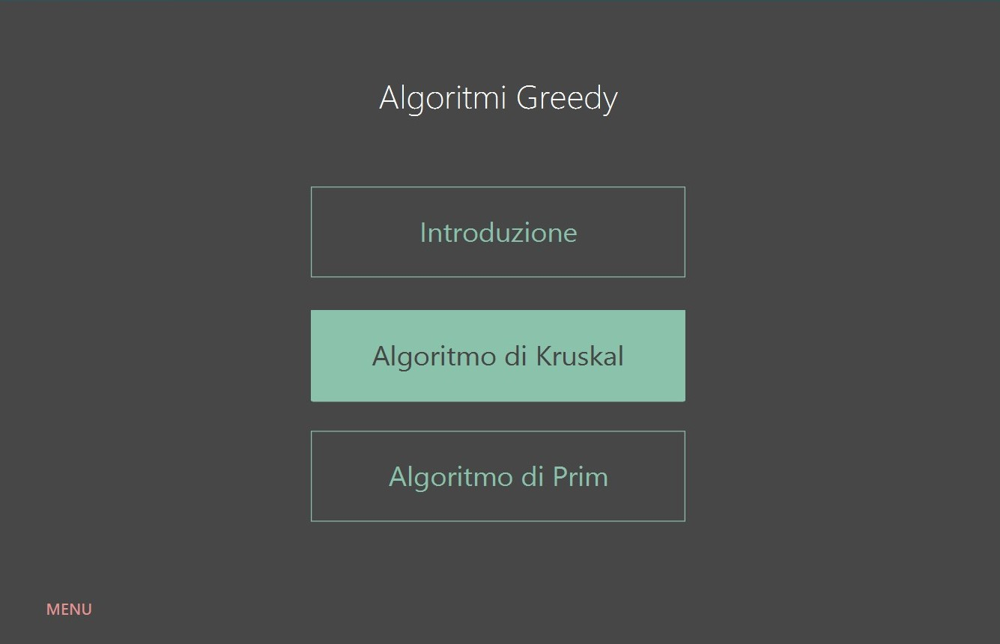
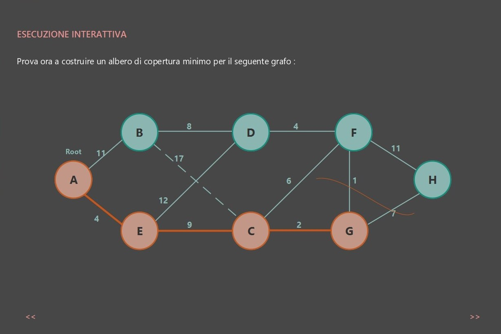

# AlgaT

---

### Table of Contents

- [Description](#description)
- [Structure](#structure)
- [Installation](#installation)
- [Author Info](#author-info)

---

## Description

AlgaT is a tutorial application based on JavaFX. It's aim is to explain what greedy programming is through explanations, interactive components and questions. The application is divided is comoposed by an introduction and two main lessons about Prim and Kruskal's algorithms.

## Structure

<ul>
<li>Game: a simple game useful to verify that the user has understood the concepts illustrated. The game takes up a typical example in the literature of greedy algorithms.</li>
<li>Lessons:
<ul>
<li>Introduction</li>
<li>Algorithms
  <ul>
  <li>Kruskal's algorithm: discussion about Kruskal's algorithm, which proceeds by points and involves the user with question and exercices.</li>
  <li>Prim's algorithm: this section deals with providing a brief introduction to Prim's algorithm, which is used to determe the minimum spanning tree for an undirected and connected graph.</li>
</li>
</ul>
</li>
</ul> 

At the end of each section, the user can find questions and exercises.

[Back To The Top](#No-Gravitar)

---

## Installation

To run the application, you can just download the '.jar' file and open it in your JVM, or if you prefer, you can download source code and compile it.

## Author Info

This project has been developed as part of 'Data Structure and Algorithms' course at the University of Bologna; 
all the code has been been written by: *Sofia Gavanelli*, *Erika Lena*, *Martina Ritrovato*.

Contact details:
- sofiagavanelli@gmail.com
- erika.lena@gmail.com
- martiross99@gmail.com

For further details you can find a '.pdf' file, containing all the details on the development of the project.

[Back To The Top](#No-Gravitar)

